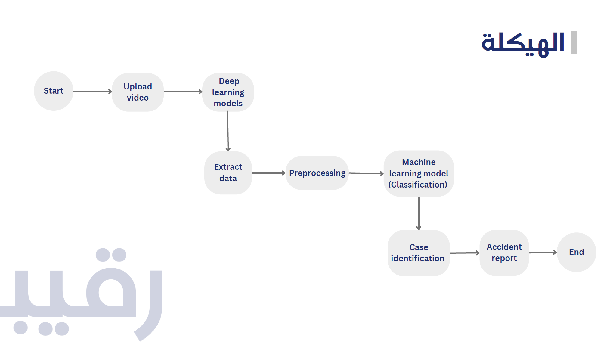
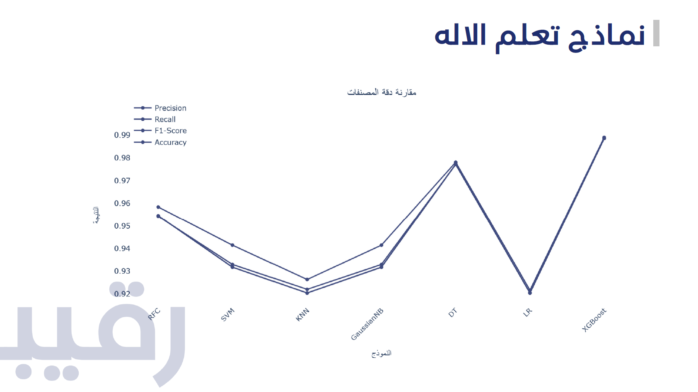

## Team Members
| Arwa Al namlan | Hajar Al Amer | Hussain Al Zawad | Rayan Baghdadi | Sadeem Fihrah|
|-|-|-|-|-|

# Introduction 
🚦 Traffic congestion is a pressing concern in many major cities, mainly caused by minor accidents which inevitably lead to more accidents. These accidents, though often minor in nature, contribute to increased congestion. Our pioneering solution "Raqeeb" (رقيب) is designed to alleviate traffic stemming from these accidents and, more crucially, mitigate the risk of subsequent incidents involving pedestrians. Ultimately, our approach results in reduced traffic congestion, decreased hazards, and quicker resolution of occurring accidents. Additionally, our system incorporates drowsiness detection to address driver fatigue-related accidents. 

"Raqeeb" tackles both traffic congestion in major cities and cost reduction for operating on accidents by addressing four common accident scenarios. We accomplish this by utilizing car dash cams to analyze video footage, which allows us to accurately determine accident responsibility in an easy process.

#### **Cases covered:**
- A car hitting another one from behind 
- A car hitting another one from the right
- A car hitting another one from the left

#### *Models used:*
- Yolo v8
- Decision Tree
- Support Vector Classification 
- Random Forest 
- Logistic Regression
- XGboost
- Naive Bayes 
- K Nearest neighborhood

### **Problems**
- Insufficient training data. 
*Solution*: Used a simulator to generate accident data.
- Extracting the data from the Yolo models.
*Solution*: Extracted and processed the data while the model is running.
- Representing each video in a single row.
*Solution*: Sampled 12 frames from each video starting from where the accident happened and then presented as a list. 
- PyCuda library require Nvidia graphics card.

### **Objectives**
- Build a model that accurately predicts covered cases 
- Streamline the process of uploading a video and generating a report 

# **Dataset overview**
| Column Name              | Description                                                  | Data Type  |
|--------------------------|--------------------------------------------------------------|------------|
| offset                   | Where the center of the car is relative to the lanes it's driving on | object     |
| xmin                     | Yolo detected minimum X coordinate of the object            | object     |
| ymin                     | Yolo detected minimum Y coordinate of the object            | object     |
| xmax                     | Yolo detected maximum X coordinate of the object            | object     |
| ymax                     | Yolo detected maximum Y coordinate of the object            | object     |
| car_direction            | Where the car is heading                                    | object     |
| car_curv                 | Value representing how much the car is rotating             | object     |
| x_lane_Two_firstPoint    | X-coordinate of the first point in lane 2                   | object     |
| y_lane_Two_firstPoint    | Y-coordinate of the first point in lane 2                   | object     |
| x_lane_Two_midPoint      | X-coordinate of the second point in lane 2                  | object     |
| y_lane_Two_midPoint      | Y-coordinate of the second point in lane 2                  | object     |
| x_lane_Two_lastPoint     | X-coordinate of the last point in lane 2                    | object     |
| y_lane_Two_lastPoint     | Y-coordinate of the last point in lane 2                    | object     |
| x_lane_Three_firstPoint  | X-coordinate of the first point in lane 3                   | object     |
| y_lane_Three_firstPoint  | Y-coordinate of the first point in lane 3                   | object     |
| x_lane_Three_midPoint    | X-coordinate of the second point in lane 3                  | object     |
| y_lane_Three_midPoint    | Y-coordinate of the second point in lane 3                  | object     |
| x_lane_Three_lastPoint   | X-coordinate of the last point in lane 3                    | object     |
| y_lane_Three_lastPoint   | Y-coordinate of the last point in lane 3                    | object     |
| case                     | Labeling of each case                                       | int64      |

## **workflow**

## **Models** 📊

For this project, we selected XGBoost as our primary model due to its excellent performance in handling structured data. After training and evaluating the model on our dataset, we achieved an impressive accuracy of 98%.

The XGBoost algorithm is a powerful gradient boosting technique that combines the strengths of decision trees with ensemble learning. It effectively handles complex relationships within the data and provides robust predictions.

We fine-tuned the hyperparameters of the XGBoost model and used techniques such as cross-validation to ensure reliable performance. The model demonstrated outstanding accuracy on our test set, indicating its capability to generalize well to unseen data.

By employing XGBoost, we were able to achieve exceptional results, making it a suitable choice for our project.

### **Conclusion and Findings**

After evaluating the performance of different models, we found that the Random Forest model achieved the highest accuracy in predicting the covered accident cases. Our approach of utilizing car dash cams and applying computer vision techniques proved effective in accurately determining accident responsibility. Our system streamlines the process of uploading accident videos and generating comprehensive reports.

Furthermore, the incorporation of draw the Accident Kroki
 We believe that our solution, “Raqeeb,” has significant potential for application in real-world scenarios, offering a practical and efficient approach to reduce traffic congestion, enhance road safety, and improve accident resolution. 🚗📈🛣️